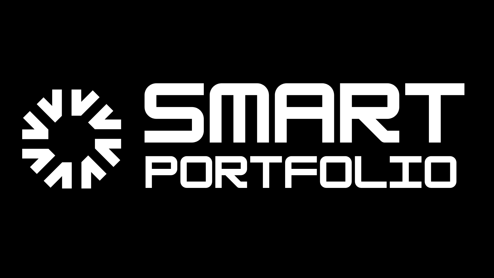

# Smart Portfolio: Web3 Made Simple



## 🚀 Project Overview

**Smart Portfolio** is a revolutionary Progressive Web App (PWA) that simplifies Web3 investing through intuitive portfolio management, seamless account abstraction, and user-friendly interfaces. Built for the Ethena Accelerator program, our platform makes crypto investing as accessible and user-friendly as traditional finance applications, but with the power and flexibility of blockchain technology.

> **Mission Statement**: Empowering everyone to navigate and maximize their Web3 investments effortlessly through excellent UI, account abstraction, seamless onboarding, and intuitive portfolio management.

## 📊 Ethena Accelerator Achievements

✅ **Participation**: Completed pitch presentation and roadmap at accelerator launch
✅ **Activity**: Attended all weekly workshops and check-ins
✅ **Completion**: Delivered MVP with basic feature prototype and comprehensive user journey
🏆 **Ready for Top Prize Consideration**: Completed all required milestones

### Project Links:
+ [PWA App (Must add to homescreen)](https://smart-portfolio-v2.vercel.app/)
+ [Final Presentation](https://www.canva.com/design/DAGhfX77nps/6iEZhY8KOLNrjROBxFa8Rg/edit?utm_content=DAGhfX77nps&utm_campaign=designshare&utm_medium=link2&utm_source=sharebutton)
+ [User Journey Live Demo](https://vimeo.com/1064962359/b2818e0e87?ts=0&share=copy)

**Old Links:**
+ [Pitch presentation, roadmap, check-in](https://www.canva.com/design/DAGcNdLOGwU/gB6t-HYGH8PqkeTYNj8JDQ/edit)
+ [Smart Contract and deployment steps](https://github.com/Kayaba-Attribution/SmartBasket/blob/main/Hardhat/scripts/deploy.ts)

### 🌟 Core Values

1. **Simplicity & Accessibility** – Breaking down Web3 barriers
2. **Security & Trust** – User control with passkeys and gasless transactions
3. **Innovation & Adaptability** – Integrating cutting-edge DeFi opportunities
4. **Community-Driven Growth** – Evolving based on real user needs


## ✨ Key Features

### 🔐 Seamless Authentication
- **Passwordless Login**: Secure authentication using passkeys - no seed phrases or passwords to remember
- **Custom Usernames**: Personalized user experience with friendly, memorable usernames
- **Account Abstraction**: Simplified blockchain interactions without technical complexity

### 📊 Portfolio Management
- **Intuitive Creation**: Build custom portfolios or use templates with just a few taps
- **Multi-Token Support**: Combine multiple tokens in a single portfolio with customizable allocations
- **Real-Time Tracking**: Monitor portfolio performance with accurate value calculations
- **Gasless Transactions**: Execute portfolio operations without worrying about gas fees

### 💰 User Engagement & Rewards
- **Points System**: Earn points for various actions within the platform
- **Referral Program**: Invite friends and earn rewards through our structured referral system
- **Achievement Tracking**: Visual representation of your platform engagement
- **Leaderboard**: Compare your progress with other users in the community

### 📱 Optimized User Experience
- **Progressive Web App**: Install directly on your device for a native-like experience
- **Mobile-First Design**: Optimized for smartphones with intuitive touch interactions
- **Offline Capabilities**: Access key features even without internet connection
- **Cross-Platform**: Works seamlessly across all modern devices and browsers

## 🚀 Live Demo & Resources

- [**Live PWA Application**](https://smart-portfolio-v2.vercel.app/) - Install on your mobile device for the best experience!
- [**User Journey Demo Video**](https://vimeo.com/1064962359/b2818e0e87?ts=0&share=copy) - See Smart Portfolio in action
- [**Final Presentation**](https://www.canva.com/design/DAGhfX77nps/6iEZhY8KOLNrjROBxFa8Rg/edit?utm_content=DAGhfX77nps&utm_campaign=designshare&utm_medium=link2&utm_source=sharebutton) - Comprehensive project overview

## 🔍 Technical Highlights

### 🏗️ Architecture
- **Next.js Application**: Modern React framework with server-side rendering
- **ZeroDev Integration**: Account abstraction using the ZeroDev SDK
- **InstantDB Backend**: Scalable database for user profiles and engagement metrics
- **Passkey Authentication**: WebAuthn for secure, passwordless authentication
- **Smart Contract Integration**: Direct interaction with on-chain portfolios

### 📱 PWA Implementation
- Robust cross-browser detection for optimal display
- Custom install flows with guided instructions
- Manifest optimization for home screen installation
- Layout optimizations for various device types

### 🪙 Points System Implementation
- Non-spendable points representing user reputation and engagement
- Comprehensive activity tracking for rewarding user actions
- Anti-abuse mechanisms to ensure fair distribution
- Transaction-linked points for blockchain activity verification

## 🚗 Roadmap

### Completed (Ethena Accelerator)
- ✅ Core PWA implementation with mobile-optimized UI
- ✅ Passkey-based authentication system
- ✅ Portfolio creation and management
- ✅ Points and rewards system
- ✅ User profile management

### Coming Soon
- 🔜 **Enso Network DeFi Integration and Ethena**
- 🔜 Social features and community engagement
- 🔜 AI-driven investment recommendations
- 🔜 Cross-chain portfolio management
- 🔜 Enhanced referral system with smart contract integration

## 👨‍💻 Development & Installation

### For Users
Simply visit [https://smart-portfolio-v2.vercel.app/](https://smart-portfolio-v2.vercel.app/) on your mobile device and follow the on-screen instructions to add the app to your home screen.

### For Developers
```bash
# Clone the repository
git clone https://github.com/YourUsername/SmartPortfolio-V2.git

# Install dependencies
npm install

# Configure environment
cp .env.example .env.local
# Edit .env.local with your credentials

# Run development server
npm run dev
```


---

Built with ❤️ for the Ethena Accelerator Program