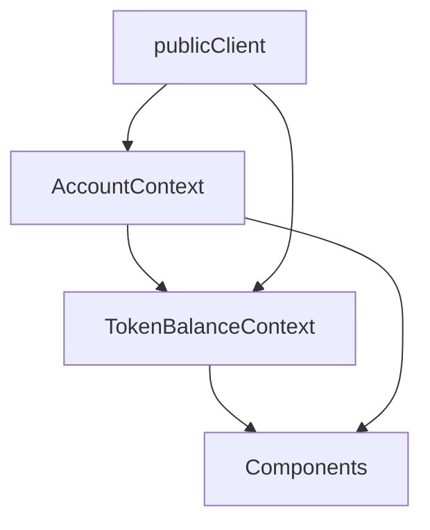
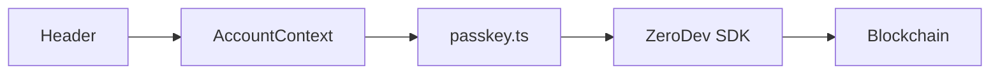

## Smart Portfolio Development Guide

### Core Architecture

1. **Account Management (`src/contexts/AccountContext.tsx`)**
```typescript
interface AccountContextType {
  account: KernelSmartAccountImplementation | null;
  client: KernelAccountClient | null;
  isLoading: boolean;
  error: Error | null;
  sendUserOp: (params: {
    contractAddress: string;
    contractABI: any;
    functionName: string;
    args: any[];
    onSuccess?: () => void;
  }) => Promise<string>;
}
```

2. **Contract Interaction Pattern**
```typescript
// Example from CreatePortfolio.tsx
const handleCreatePortfolio = async () => {
  if (!account || !amount) return;
  
  try {
    const allocations = tokens.map((token) => ({
      tokenAddress: TOKENS[token.symbol].address,
      percentage: token.allocation,
      amount: 0, // Contract calculates
    }));

    const userOpHash = await sendUserOp({
      contractAddress: addresses.core.SmartPortfolio,
      contractABI: SMART_PORTFOLIO_ABI.abi,
      functionName: "createBasket",
      args: [allocations, amountInWei],
      onSuccess: () => {
        toast.success("Success!");
        // Reset form...
      },
    });

    // Show transaction feedback
    toast.promise(/* ... */);
  } catch (error) {
    toast.error(/* ... */);
  }
};
```

### PWA Implementation & Landing Page

1. **PWA Detection (`src/app/page.tsx`)**
```typescript
// Robust PWA detection
useEffect(() => {
  setMounted(true);

  // Multiple detection methods for cross-browser compatibility
  const isPWA =
    window.matchMedia("(display-mode: standalone)").matches ||
    document.referrer.includes("android-app://");
  
  console.log("PWA detection:", {
    matchMedia: window.matchMedia("(display-mode: standalone)").matches,
    referrer: document.referrer.includes("android-app://"),
  });
  
  setIsStandalone(isPWA);

  // Redirect to app view if PWA
  if (isPWA) {
    router.push("/app");
  }
}, [router]);

// Only render content after client-side detection
if (!mounted) return null;

// For PWA mode, don't show landing page
if (isStandalone) return null;
```

2. **App Layout Management (`src/app/app/layout.tsx`)**
```typescript
export default function AppLayout({ children }) {
  // Add data attribute to html element for app routes
  useEffect(() => {
    document.documentElement.setAttribute("data-app-route", "true");
    
    return () => {
      document.documentElement.removeAttribute("data-app-route");
    };
  }, []);

  return (
    <div style={{ position: "fixed", width: "100%", height: "100%" }}>
      <Header />
      <main className="h-[100dvh] pt-16 pb-20 overflow-y-auto">
        <AnimatePresence mode="wait">{children}</AnimatePresence>
      </main>
      <BottomNav />
    </div>
  );
}
```

3. **Conditional Styling (`src/app/globals.css`)**
```css
/* Modified styles to allow scrolling on landing page but not in app */
html {
  overscroll-behavior: none;
  background-color: black;
}

/* App-specific styles applied only to app routes */
html[data-app-route="true"] {
  overflow: hidden;
}

body {
  font-family: Arial, Helvetica, sans-serif;
  overscroll-behavior: none;
  -webkit-overflow-scrolling: touch;
  background-color: black;
}
```

4. **Installation Guide Component**
```typescript
export function InstallPrompt({ inline = false }) {
  // PWA detection
  const [isStandalone, setIsStandalone] = useState(false);
  
  const scrollToInstall = () => {
    const element = document.getElementById("install-guide");
    if (element) {
      element.scrollIntoView({ behavior: "smooth" });
    }
  };

  return inline ? (
    <Button
      variant="outline"
      size="lg"
      className="text-lg"
      onClick={scrollToInstall}
    >
      <PlusCircle className="mr-2 h-5 w-5" />
      How to Install
    </Button>
  ) : (
    <Button onClick={scrollToInstall} variant="outline" size="lg">
      <PlusCircle className="mr-2 h-5 w-5" />
      How to Install
    </Button>
  );
}
```

### Development Patterns

1. **State Management**
- Use contexts for global state (Account, TokenBalance)
- Component-level state with useState
- Callbacks with useCallback for effect dependencies

2. **Toast Notifications (using Sonner)**
```typescript
// Success notification
toast.success("Operation completed!");

// Error notification
toast.error("Something went wrong");

// Transaction feedback
toast.promise(
  promise,
  {
    loading: 'Processing...',
    success: (data) => 'Success!',
    error: (err) => 'Error: ' + err.message
  }
);
```

3. **Contract Interaction Flow**
- Check account connection
- Format input data
- Send transaction via sendUserOp
- Handle success/error with toast
- Update UI state
- Refresh relevant data

4. **Common Code Patterns**

a. **Account Check**
```typescript
if (!account) return;
```

b. **Loading States**
```typescript
const [isLoading, setIsLoading] = useState(false);

try {
  setIsLoading(true);
  // operation
} finally {
  setIsLoading(false);
}
```

c. **Effect Dependencies**
```typescript
const callback = useCallback(() => {
  // function body
}, [required, dependencies]);

useEffect(() => {
  callback();
}, [callback]);
```

### File Organization

1. **Contract Artifacts**
- Place in `src/contracts/artifacts/`
- Include full ABI with proper typing
- Export contract addresses from `addresses.json`

2. **Components**
- UI components in `src/components/`
- Page components in `src/app/`
- Context providers in `src/contexts/`

3. **Utilities**
- Web3 utilities in `src/lib/web3.ts`
- Shared helpers in `src/lib/utils.ts`

### Common Gotchas

1. **Effect Dependencies**
- Always include all dependencies
- Use useCallback for function dependencies
- Watch for infinite loops

2. **Type Safety**
- Use proper typing for contract ABIs
- Handle undefined/null states
- Type check component props

3. **Error Handling**
- Always wrap async operations in try/catch
- Provide user feedback via toast
- Log errors for debugging

### Development Tips for Cursor

1. **Quick Fixes**
- Look for similar patterns in existing code
- Check for missing dependencies in useEffect
- Verify contract ABI matches function calls

2. **Common Commands**
- "Fix the error on [file]"
- "Update [component] to use [pattern]"
- "Add toast notifications to [component]"

3. **Code Organization**
- Keep related code together
- Use consistent formatting
- Add comments for complex logic

4. **Testing Approach**
- Test contract interactions
- Verify UI feedback
- Check error handling

### Core System Architecture

1. **Passkey Management (`src/lib/passkey.ts`)**
```typescript
// Core client setup
export const publicClient = createPublicClient({
  chain: baseSepolia,
  transport: http()
});

// Account creation flow
export async function handleRegister(username: string) {
  const webAuthnKey = await toWebAuthnKey({
    passkeyName: username,
    passkeyServerUrl: PASSKEY_SERVER_URL,
    mode: WebAuthnMode.Register
  });
  
  // Create account and return
  return createAccountWithPasskey(webAuthnKey);
}

// Login flow
export async function loginWithPasskey(username: string) {
  const webAuthnKey = await toWebAuthnKey({
    passkeyName: username,
    passkeyServerUrl: PASSKEY_SERVER_URL,
    mode: WebAuthnMode.Login
  });
  
  return createAccountWithPasskey(webAuthnKey);
}
```

2. **Account Context (`src/contexts/AccountContext.tsx`)**
```typescript
export function AccountProvider({ children }: { children: ReactNode }) {
  // Core state
  const [account, setAccount] = useState<KernelSmartAccountImplementation | null>(null);
  const [client, setClient] = useState<KernelAccountClient | null>(null);
  
  // Helper for sending transactions
  const sendUserOp = async ({
    contractAddress,
    contractABI,
    functionName,
    args,
    onSuccess
  }) => {
    if (!account || !client) throw new Error("No account");
    // Transaction handling...
  };

  // Auto-login on mount
  useEffect(() => {
    const storedUsername = localStorage.getItem("username");
    if (storedUsername) {
      handlePasskeyLogin(storedUsername);
    }
  }, []);
}
```

3. **Token Balance Management (`src/contexts/TokenBalanceContext.tsx`)**
```typescript
export function TokenBalanceProvider({ children }: { children: ReactNode }) {
  const { account } = useAccount();
  const [balances, setBalances] = useState<TokenBalances>({});
  
  const refreshBalances = useCallback(async () => {
    if (!account) return;
    // Fetch balances for all tokens...
  }, [account]);

  useEffect(() => {
    refreshBalances();
  }, [refreshBalances]);
}
```

4. **Application Layout (`src/app/layout.tsx`)**
```typescript
export default function RootLayout({ children }: { children: ReactNode }) {
  return (
    <html lang="en">
      <body>
        <Providers>
          <Header />
          <main>
            <AnimatePresence mode="wait">
              {children}
            </AnimatePresence>
          </main>
          <BottomNav />
          <Toaster />
        </Providers>
      </body>
    </html>
  );
}
```

5. **Header Component (`src/components/Header.tsx`)**
```typescript
export function Header() {
  const { account, registerPasskey, username, logout } = useAccount();
  
  const handleConnect = async () => {
    const username = `user_${Date.now()}`;
    await registerPasskey(username);
  };

  return (
    <header>
      {account ? (
        <AccountInfo /> 
      ) : (
        <ConnectButton onClick={handleConnect} />
      )}
    </header>
  );
}
```

### Key Integration Points

1. **Provider Hierarchy**
```typescript
export function Providers({ children }: { children: ReactNode }) {
  return (
    <ThemeProvider>
      <AccountProvider>
        <TokenBalanceProvider>
          {children}
        </TokenBalanceProvider>
      </AccountProvider>
    </ThemeProvider>
  );
}
```

2. **Data Flow**


3. **Authentication Flow**


### Best Practices

1. **State Management**
- Use AccountContext for authentication state
- Use TokenBalanceContext for token data
- Keep UI state local to components
- Use callbacks for effect dependencies

2. **Error Handling**
- Wrap async operations in try/catch
- Use toast for user feedback
- Log errors to console
- Handle loading states

3. **Component Organization**
- Keep authentication logic in contexts
- Use shared components for common UI
- Implement page-specific logic in page components
- Follow atomic design principles

4. **Performance**
- Use useCallback for function dependencies
- Memoize expensive calculations
- Implement proper loading states
- Handle data fetching efficiently

5. **PWA Best Practices**
- Add robust PWA detection with multiple methods
- Use appropriate viewport settings
- Implement app-specific scrolling behavior
- Provide detailed installation instructions
- Design for both installed and web experiences
- Use responsive designs for all device types