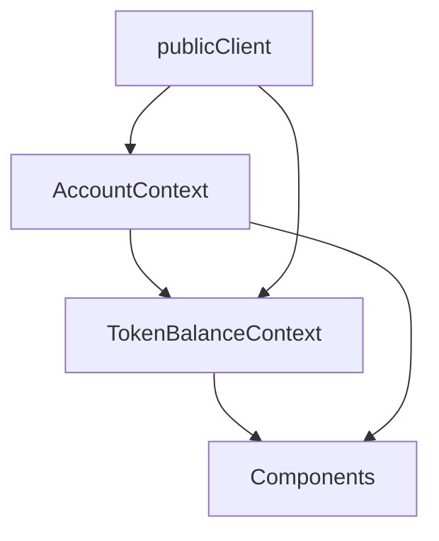
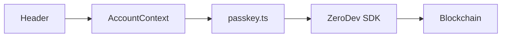
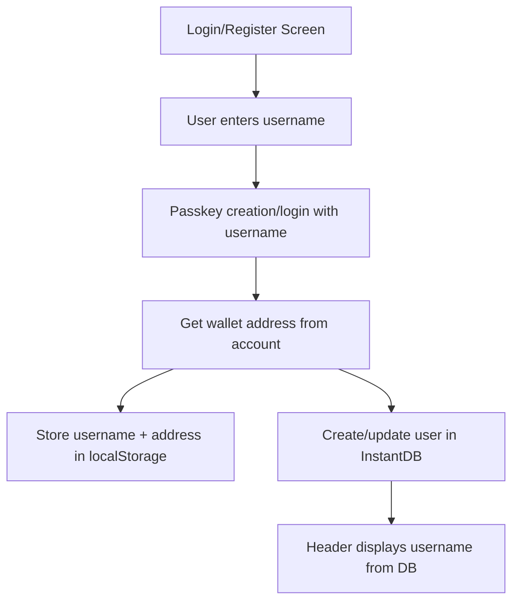
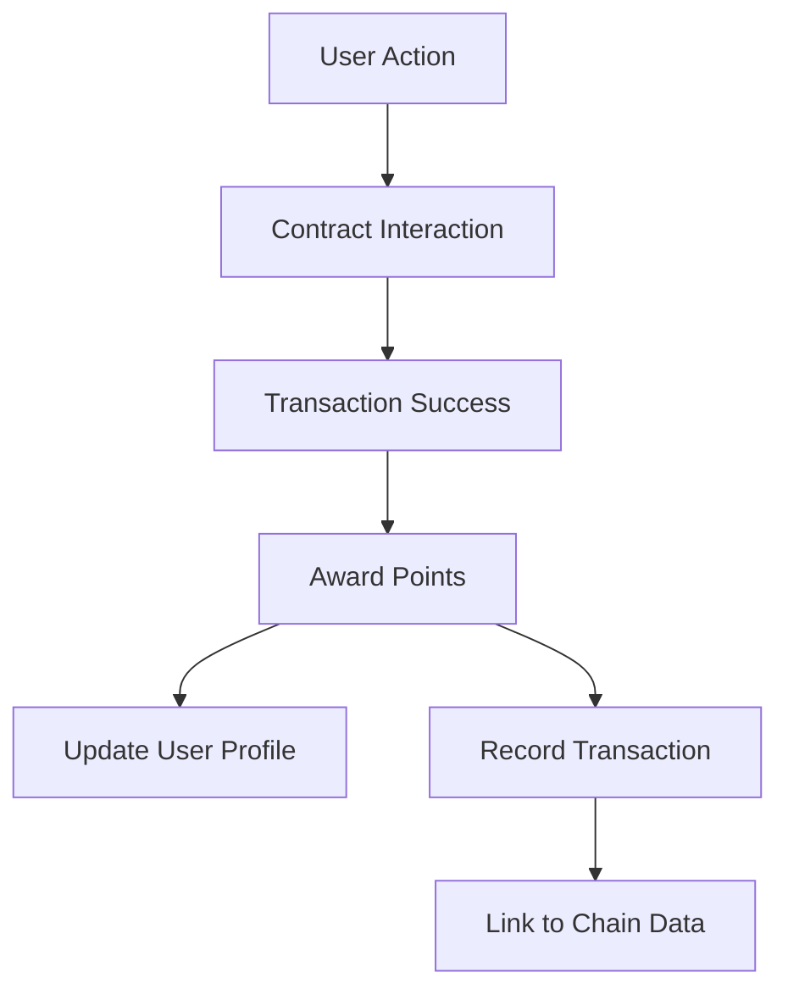

## Smart Portfolio Development Guide

### Core Architecture

1. **Account Management (`src/contexts/AccountContext.tsx`)**
```typescript
interface AccountContextType {
  account: KernelSmartAccountImplementation | null;
  client: KernelAccountClient | null;
  accountAddress: string | null;
  isLoading: boolean;
  error: Error | null;
  registerPasskey: (tempId: string, displayUsername?: string) => Promise<void>;
  loginWithPasskey: (tempId: string, displayUsername?: string) => Promise<void>;
  username: string | null;
  sendUserOp: (params: {
    contractAddress: string;
    contractABI: any;
    functionName: string;
    args: any[];
    onSuccess?: () => void;
  }) => Promise<string>;
}
```

2. **Contract Interaction Pattern**
```typescript
// Example from CreatePortfolio.tsx
const handleCreatePortfolio = async () => {
  if (!account || !amount) return;
  
  try {
    const allocations = tokens.map((token) => ({
      tokenAddress: TOKENS[token.symbol].address,
      percentage: token.allocation,
      amount: 0, // Contract calculates
    }));

    const userOpHash = await sendUserOp({
      contractAddress: addresses.core.SmartPortfolio,
      contractABI: SMART_PORTFOLIO_ABI.abi,
      functionName: "createBasket",
      args: [allocations, amountInWei],
      onSuccess: () => {
        toast.success("Success!");
        // Reset form...
      },
    });

    // Show transaction feedback
    toast.promise(/* ... */);
  } catch (error) {
    toast.error(/* ... */);
  }
};
```

### PWA Implementation & Landing Page

1. **PWA Detection (`src/app/page.tsx`)**
```typescript
// Robust PWA detection
useEffect(() => {
  setMounted(true);

  // Multiple detection methods for cross-browser compatibility
  const isPWA =
    window.matchMedia("(display-mode: standalone)").matches ||
    document.referrer.includes("android-app://");
  
  console.log("PWA detection:", {
    matchMedia: window.matchMedia("(display-mode: standalone)").matches,
    referrer: document.referrer.includes("android-app://"),
  });
  
  setIsStandalone(isPWA);

  // Redirect to app view if PWA
  if (isPWA) {
    router.push("/app");
  }
}, [router]);

// Only render content after client-side detection
if (!mounted) return null;

// For PWA mode, don't show landing page
if (isStandalone) return null;
```

2. **App Layout Management (`src/app/app/layout.tsx`)**
```typescript
export default function AppLayout({ children }) {
  // Add data attribute to html element for app routes
  useEffect(() => {
    document.documentElement.setAttribute("data-app-route", "true");
    
    return () => {
      document.documentElement.removeAttribute("data-app-route");
    };
  }, []);

  return (
    <div style={{ position: "fixed", width: "100%", height: "100%" }}>
      <Header />
      <main className="h-[100dvh] pt-16 pb-20 overflow-y-auto">
        <AnimatePresence mode="wait">{children}</AnimatePresence>
      </main>
      <BottomNav />
    </div>
  );
}
```

3. **Conditional Styling (`src/app/globals.css`)**
```css
/* Modified styles to allow scrolling on landing page but not in app */
html {
  overscroll-behavior: none;
  background-color: black;
}

/* App-specific styles applied only to app routes */
html[data-app-route="true"] {
  overflow: hidden;
}

body {
  font-family: Arial, Helvetica, sans-serif;
  overscroll-behavior: none;
  -webkit-overflow-scrolling: touch;
  background-color: black;
}
```

4. **Installation Guide Component**
```typescript
export function InstallPrompt({ inline = false }) {
  // PWA detection
  const [isStandalone, setIsStandalone] = useState(false);
  
  const scrollToInstall = () => {
    const element = document.getElementById("install-guide");
    if (element) {
      element.scrollIntoView({ behavior: "smooth" });
    }
  };

  return inline ? (
    <Button
      variant="outline"
      size="lg"
      className="text-lg"
      onClick={scrollToInstall}
    >
      <PlusCircle className="mr-2 h-5 w-5" />
      How to Install
    </Button>
  ) : (
    <Button onClick={scrollToInstall} variant="outline" size="lg">
      <PlusCircle className="mr-2 h-5 w-5" />
      How to Install
    </Button>
  );
}
```

### Development Patterns

1. **State Management**
- Use contexts for global state (Account, TokenBalance)
- Component-level state with useState
- Callbacks with useCallback for effect dependencies

2. **Toast Notifications (using Sonner)**
```typescript
// Success notification
toast.success("Operation completed!");

// Error notification
toast.error("Something went wrong");

// Transaction feedback
toast.promise(
  promise,
  {
    loading: 'Processing...',
    success: (data) => 'Success!',
    error: (err) => 'Error: ' + err.message
  }
);
```

3. **Contract Interaction Flow**
- Check account connection
- Format input data
- Send transaction via sendUserOp
- Handle success/error with toast
- Update UI state
- Refresh relevant data

4. **Common Code Patterns**

a. **Account Check**
```typescript
if (!account) return;
```

b. **Loading States**
```typescript
const [isLoading, setIsLoading] = useState(false);

try {
  setIsLoading(true);
  // operation
} finally {
  setIsLoading(false);
}
```

c. **Effect Dependencies**
```typescript
const callback = useCallback(() => {
  // function body
}, [required, dependencies]);

useEffect(() => {
  callback();
}, [callback]);
```

### File Organization

1. **Contract Artifacts**
- Place in `src/contracts/artifacts/`
- Include full ABI with proper typing
- Export contract addresses from `addresses.json`

2. **Components**
- UI components in `src/components/`
- Page components in `src/app/`
- Context providers in `src/contexts/`

3. **Utilities**
- Web3 utilities in `src/lib/web3.ts`
- Shared helpers in `src/lib/utils.ts`

### Common Gotchas

1. **Effect Dependencies**
- Always include all dependencies
- Use useCallback for function dependencies
- Watch for infinite loops

2. **Type Safety**
- Use proper typing for contract ABIs
- Handle undefined/null states
- Type check component props

3. **Error Handling**
- Always wrap async operations in try/catch
- Provide user feedback via toast
- Log errors for debugging

### Development Tips for Cursor

1. **Quick Fixes**
- Look for similar patterns in existing code
- Check for missing dependencies in useEffect
- Verify contract ABI matches function calls

2. **Common Commands**
- "Fix the error on [file]"
- "Update [component] to use [pattern]"
- "Add toast notifications to [component]"

3. **Code Organization**
- Keep related code together
- Use consistent formatting
- Add comments for complex logic

4. **Testing Approach**
- Test contract interactions
- Verify UI feedback
- Check error handling

### Core System Architecture

1. **Passkey Management (`src/lib/passkey.ts`)**
```typescript
// Core client setup
export const publicClient = createPublicClient({
  chain: baseSepolia,
  transport: http()
});

// Fixed passkey app name for identification in browsers
const APP_PASSKEY_NAME = "SmartPortfolio";

// Account creation flow with custom username
export async function handleRegister(tempId: string, displayUsername?: string) {
  // Combine username with APP_PASSKEY_NAME for the passkey name
  const passkeyName = displayUsername ? `${displayUsername} - ${APP_PASSKEY_NAME}` : APP_PASSKEY_NAME;
  
  const webAuthnKey = await toWebAuthnKey({
    passkeyName,
    passkeyServerUrl: ZERODEV_CONFIG.passkeyServerUrl,
    mode: WebAuthnMode.Register
  });
  
  // Create account and return
  return createAccountAndClient(passkeyValidator);
}

// Login flow with custom username
export async function loginWithPasskey(tempId: string, displayUsername?: string) {
  // Use provided username if available
  const passkeyName = displayUsername ? `${displayUsername} - ${APP_PASSKEY_NAME}` : APP_PASSKEY_NAME;
  
  const webAuthnKey = await toWebAuthnKey({
    passkeyName,
    passkeyServerUrl: ZERODEV_CONFIG.passkeyServerUrl,
    mode: WebAuthnMode.Login
  });
  
  // Continue with authentication
  // ...
}
```

2. **Account Context (`src/contexts/AccountContext.tsx`)**
```typescript
export function AccountProvider({ children }: { children: ReactNode }) {
  // Core state
  const [account, setAccount] = useState<KernelSmartAccountImplementation | null>(null);
  const [client, setClient] = useState<KernelAccountClient | null>(null);
  const [accountAddress, setAccountAddress] = useState<string | null>(null);
  const [username, setUsername] = useState<string | null>(null);
  
  // Registration handler with username support
  const handlePasskeyRegistration = async (tempId: string, displayUsername?: string) => {
    // Create account with the display username
    const { account: newAccount, client: newClient } = await handleRegister(tempId, displayUsername);
    
    // Get the wallet address as the unique identifier
    const address = await newAccount.getAddress();
    
    // Use provided display username or generate one
    const userDisplayName = displayUsername?.trim() || `user_${address.slice(0, 6)}`;
    
    // Store in localStorage for persistence
    localStorage.setItem("accountAddress", address);
    localStorage.setItem("displayUsername", userDisplayName);
    
    // Create user record in InstantDB
    await createUser(address, userDisplayName);
  };
  
  // Helper for sending transactions
  const sendUserOp = async ({
    contractAddress,
    contractABI,
    functionName,
    args,
    onSuccess
  }) => {
    if (!account || !client) throw new Error("No account");
    // Transaction handling...
  };
}
```

3. **Token Balance Management (`src/contexts/TokenBalanceContext.tsx`)**
```typescript
export function TokenBalanceProvider({ children }: { children: ReactNode }) {
  const { account } = useAccount();
  const [balances, setBalances] = useState<TokenBalances>({});
  
  const refreshBalances = useCallback(async () => {
    if (!account) return;
    // Fetch balances for all tokens...
  }, [account]);

  useEffect(() => {
    refreshBalances();
  }, [refreshBalances]);
}
```

4. **Application Layout (`src/app/layout.tsx`)**
```typescript
export default function RootLayout({ children }: { children: ReactNode }) {
  return (
    <html lang="en">
      <body>
        <Providers>
          <Header />
          <main>
            <AnimatePresence mode="wait">
              {children}
            </AnimatePresence>
          </main>
          <BottomNav />
          <Toaster />
        </Providers>
      </body>
    </html>
  );
}
```

5. **Header Component (`src/components/Header.tsx`)**
```typescript
export function Header() {
  // Get account data from context
  const { account, accountAddress, logout } = useAccount();
  // State for username from database
  const [dbUsername, setDbUsername] = useState<string | null>(null);

  // Query the database for the user profile
  const { data } = db.useQuery(
    accountAddress ? getUserByAddressQuery(accountAddress) : null
  );

  // Update username when data changes
  useEffect(() => {
    if (data && data.userProfiles && data.userProfiles.length > 0) {
      setDbUsername(data.userProfiles[0].username || null);
    }
  }, [data]);

  return (
    <header>
      {account && accountAddress ? (
        <div className="flex items-center gap-4">
          <div className="text-sm flex flex-col items-end">
            {dbUsername && <span className="font-medium">{dbUsername}</span>}
            <span className="text-xs text-muted-foreground">
              {accountAddress && `${accountAddress.slice(0, 6)}...${accountAddress.slice(-4)}`}
            </span>
          </div>
          <Button variant="outline" size="sm" onClick={logout}>
            Logout
          </Button>
        </div>
      ) : (
        <ConnectButton />
      )}
    </header>
  );
}
```

### Key Integration Points

1. **Provider Hierarchy**
```typescript
export function Providers({ children }: { children: ReactNode }) {
  return (
    <ThemeProvider>
      <AccountProvider>
        <TokenBalanceProvider>
          {children}
        </TokenBalanceProvider>
      </AccountProvider>
    </ThemeProvider>
  );
}
```

2. **Data Flow**


3. **Authentication Flow**


### Best Practices

1. **State Management**
- Use AccountContext for authentication state
- Use TokenBalanceContext for token data
- Keep UI state local to components
- Use callbacks for effect dependencies

2. **Error Handling**
- Wrap async operations in try/catch
- Use toast for user feedback
- Log errors to console
- Handle loading states

3. **Component Organization**
- Keep authentication logic in contexts
- Use shared components for common UI
- Implement page-specific logic in page components
- Follow atomic design principles

4. **Performance**
- Use useCallback for function dependencies
- Memoize expensive calculations
- Implement proper loading states
- Handle data fetching efficiently

5. **PWA Best Practices**
- Add robust PWA detection with multiple methods
- Use appropriate viewport settings
- Implement app-specific scrolling behavior
- Provide detailed installation instructions
- Design for both installed and web experiences
- Use responsive designs for all device types

### InstantDB Data Model

The application uses InstantDB for managing user profiles and points:

```typescript
// Schema definition (instant.schema.ts)
const _schema = i.schema({
  entities: {
    userProfiles: i.entity({
      walletAddress: i.string().unique().indexed(), // Wallet address as unique identifier
      username: i.string().optional().indexed(),    // Custom display name
      totalPoints: i.number().indexed(),            // Points accumulated
      createdAt: i.number().indexed(),              // Account creation timestamp
      referrerId: i.string().optional().indexed(),  // For referral tracking
    }),
    // Other entities...
  },
  // Links between entities...
});
```

### Authentication Flow



### Key User Experience Features

1. **Custom Username Registration**
   - Users can choose a custom username during registration
   - Username is stored in InstantDB and displayed in the header
   - Passkeys are created with a combined name: `username - SmartPortfolio`

2. **Wallet Address as Primary Identifier**
   - Wallet addresses serve as unique identifiers in the database
   - All blockchain interactions use the wallet address
   - Username is purely for display and user experience

3. **Persistent User Profiles**
   - User profiles are stored in InstantDB with the wallet address as unique key
   - Points and other user data are associated with their wallet address
   - Username can be displayed consistently across the application

### Points System Implementation

The application features a comprehensive points system with transaction tracking:



1. **Points Actions Structure (`src/lib/pointsActions.ts`)**
```typescript
export const POINTS_ACTIONS = {
    FAUCET: {
        id: '33f1576a-456f-4f81-939a-f972aca8ba0e',
        name: 'FAUCET_USE',
        description: 'Claimed tokens from the faucet',
        points: 10,
        cooldown: 86400000 // 24 hours
    },
    PORTFOLIO_CUSTOM_CREATED: {
        id: '453926ad-b02b-4e9a-886c-ffefe5de8d42',
        name: 'PORTFOLIO_CUSTOM_CREATED',
        description: 'Created a new custom portfolio',
        points: 25,
        cooldown: 86400000 // 24 hours
    },
    PORTFOLIO_TEMPLATE_CREATED: {
        id: 'e69f1531-0435-4543-8bab-0b47ae664ad8',
        name: 'PORTFOLIO_TEMPLATE_CREATED',
        description: 'Created a new template portfolio',
        points: 25,
        cooldown: 86400000 // 24 hours
    }
};
```

2. **Transaction Tracking (`src/lib/db.ts`)**
```typescript
export async function addPoints(
    userId: string,
    actionId: string,
    points: number,
    userPoints: number,
    userProfileId: string,
    txHash?: string,
    chainId?: number
) {
    // Generate a unique ID for the transaction
    const transactionId = id();
    
    try {
        // Create a points transaction, update the user's total points, and create links
        await db.transact([
            // Create points transaction record with blockchain data
            tx.pointsTransactions[transactionId]
                .update({
                    userId,
                    actionId,
                    points,
                    timestamp: Date.now(),
                    txHash: txHash || '',
                    chainId: chainId || 0,
                })
                .link({ action: actionId }),

            // Update user's total points
            tx.userProfiles[userProfileId]
                .update({ totalPoints: userPoints + points })
                .link({ pointsTransactions: transactionId }),

            // Link action to transaction for reporting
            tx.actions[actionId].link({ transactions: transactionId })
        ]);
        
        return transactionId;
    } catch (error) {
        console.error("Error adding points:", error);
        throw error;
    }
}
```

3. **Portfolio Creation with Points Integration**
```typescript
// In CreatePortfolio.tsx
const handleCreatePortfolio = async () => {
  if (!account || !amount || !accountAddress) return;

  try {
    // Transaction details...
    const userOpHash = await sendUserOp({
      // Contract call details...
      onSuccess: async () => {
        // Create portfolio in InstantDB
        if (accountAddress && userProfile) {
          try {
            // Create the portfolio in InstantDB
            const portfolioId = await createPortfolio(
              accountAddress,
              mode === "template" ? "template" : "custom"
            );

            // Award points based on portfolio type
            const actionType =
              mode === "template"
                ? POINTS_ACTIONS.PORTFOLIO_TEMPLATE_CREATED
                : POINTS_ACTIONS.PORTFOLIO_CUSTOM_CREATED;

            const transactionId = await addPoints(
              accountAddress,
              actionType.id,
              actionType.points,
              currentPoints,
              userProfile.id,
              userOpHash,
              ZERODEV_CONFIG.chain.id
            );
          } catch (error) {
            // Error handling...
          }
        }
      },
    });
  } catch (error) {
    // Error handling...
  }
};
```

4. **Portfolio Database Integration**
```typescript
export async function createPortfolio(userId: string, type: string) {
    // Generate a unique ID for the portfolio
    const portfolioId = id();
    
    try {
        // Find the user profile to get its ID for linking
        const { data: userData } = await db.queryOnce({
            userProfiles: {
                $: { where: { walletAddress: userId } },
            },
        });

        const userProfile = userData?.userProfiles?.[0];
        
        if (!userProfile) {
            throw new Error(`User profile not found for wallet address: ${userId}`);
        }

        // Create the portfolio with explicit links
        await db.transact([
            // Create the portfolio
            tx.portfolios[portfolioId].update({
                userId,
                type,
                createdAt: Date.now(),
            }),

            // Link the portfolio to the user using the profile ID
            tx.userProfiles[userProfile.id].link({
                portfolios: portfolioId
            }),
        ]);
        
        return portfolioId;
    } catch (error) {
        console.error("Error creating portfolio:", error);
        throw error;
    }
}
```

5. **Debugging Strategies**

When implementing points integrations, detailed logging is essential for diagnosing issues:

```typescript
// Detailed debug logging
console.log("Starting portfolio creation with:", { 
  mode, 
  accountAddress, 
  userProfile: userProfile ? { id: userProfile.id, points: userProfile.totalPoints } : null 
});

// Log each step of the process
console.log("Transaction successful, creating portfolio in DB for:", accountAddress);
console.log("Portfolio created in DB with ID:", portfolioId);
console.log("Adding points for action:", { 
  actionId: actionType.id, 
  actionName: actionType.name,
  points: actionType.points,
  currentPoints,
  userProfileId: userProfile.id
});
console.log("Points transaction created with ID:", transactionId);

// Proper error handling with detailed information
try {
  // Operation
} catch (error) {
  console.error("Error updating portfolio in database:", error);
  console.error("Error details:", JSON.stringify(error, null, 2));
}
```

This implementation provides:
- Complete traceability between blockchain transactions and points
- Cross-chain support via chainId tracking
- Action-specific point values and cooldowns
- Relationship tracking between users, actions, portfolios, and transactions
- Proper error handling with detailed logging
- Entity linking ensuring data integrity

### Portfolio Value Calculation

1. **BigInt Value Handling**

The application works with BigInt values from smart contracts, which requires careful handling when converting to display values:

```typescript
// AVOID: This can cause issues with formatValue when used with Number()
const value = Number(formatValue(portfolio.totalValue)) || 0;

// CORRECT: Direct numeric conversion without localization formatting
const getNumericValue = (value: bigint, decimals = 18) => {
  try {
    return Number(formatUnits(value, decimals));
  } catch (error) {
    console.error("Error converting value to number:", error);
    return 0;
  }
};
const value = getNumericValue(portfolio.totalValue);
```

2. **Combined Assets Hook (`src/hooks/useCombinedAssets.tsx`)**

The `useCombinedAssets` hook provides portfolio data for the UI by:
- Processing portfolio details from smart contracts
- Converting BigInt values to human-readable formats
- Calculating total values across multiple portfolios
- Combining wallet and portfolio balances

Key considerations:
- Always add null checks with fallbacks using `|| 0`
- Log intermediate values for easier debugging
- Use direct numeric conversion to avoid NaN issues
- Ensure proper type handling in the presentation layer

```typescript
// Calculating the total value of all portfolios
const totalPortfolioValue = useMemo(() => {
  if (!portfolioDetails.length) return 0;

  return portfolioDetails.reduce((total, portfolio, index) => {
    if (!portfolio.totalValue) return total;
    const value = getNumericValue(portfolio.totalValue);
    console.log(`Portfolio ${index}: Value = ${value}`);
    return total + value;
  }, 0);
}, [portfolioDetails]);
```

3. **Common Portfolio Value Bugs**

When debugging portfolio values, check for:
- String formatting issues (locale strings with commas causing NaN)
- Missing null/undefined checks
- Missed portfolios in iteration (especially first or last)
- BigInt conversion issues
- UI display vs. actual numeric calculation discrepancies